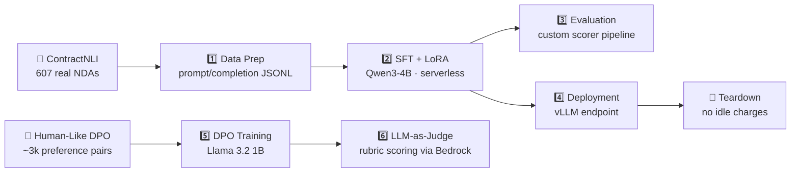

# 🚀 SageMaker AI Model Customization

[](https://www.python.org/)
[](https://aws.amazon.com/sagemaker/)
[](LICENSE)
[](https://github.com/sourangshupal/sagemaker-model-customization-demo/pulls)

**Serverless model customization on [Amazon SageMaker AI](https://aws.amazon.com/sagemaker/) — end to end.**
Fine-tune open models with **LoRA**, align them to human preferences with **DPO**, evaluate them with managed pipelines and LLM-as-judge, and deploy to a **vLLM** endpoint — all without provisioning a single instance.

This repo is a runnable companion to the AWS workshop
[*Serverless Model Customization with Amazon SageMaker AI*](https://catalog.workshops.aws/workshops/548b5be9-2da8-4c93-82f7-b0b474108ab3/en-US)
([source](https://github.com/aws-samples/generative-ai-on-amazon-sagemaker)). It runs the same steps **from your local machine**, outside SageMaker Studio and without the workshop's CloudFormation stack.

---

## 📑 Table of Contents

- [✨ Features](#-features)
- [🏗️ Pipeline Overview](#️-pipeline-overview)
- [📋 Prerequisites](#-prerequisites)
- [⚙️ Setup](#️-setup)
- [▶️ Usage](#️-usage)
- [📓 Beginner Notebook](#-beginner-notebook)
- [📊 Expected Results](#-expected-results)
- [💰 Cost Summary](#-cost-summary)
- [🛠️ Troubleshooting](#️-troubleshooting)
- [🤝 Contributing](#-contributing)
- [⚠️ Disclaimer](#️-disclaimer)
- [📄 License](#-license)

---

## ✨ Features

| Capability | Details |
|------------|---------|
| 🎯 **Supervised Fine-Tuning (SFT)** | LoRA adapters on **Qwen3-4B** — trains millions of parameters instead of billions |
| ⚖️ **Preference Optimization (DPO)** | Aligns **Llama 3.2 1B** to human preferences — no reward model, no RL loop |
| 🧪 **Managed Evaluation** | Custom scorer as a reward function + **LLM-as-judge** (Claude via Bedrock) with custom rubrics |
| 🖥️ **vLLM Deployment** | Merged checkpoint → DJL/vLLM container → OpenAI-compatible API, with safe teardown |
| 💸 **True Serverless** | No instance types, no clusters, no capacity planning — billed per token processed |
| 📈 **Zero-Config Tracking** | Every run logged to a managed **MLflow** tracking server automatically |

---

## 🏗️ Pipeline Overview



| Step | Script | What happens | Duration* |
|------|--------|--------------|-----------|
| 1️⃣ | [`scripts/01_data_prep_sft.py`](scripts/01_data_prep_sft.py) | ContractNLI → prompt/completion JSONL → S3 → SageMaker AI Registry | ~5 min |
| 2️⃣ | [`scripts/02_train_sft.py`](scripts/02_train_sft.py) | Serverless LoRA SFT of Qwen3-4B (`SFTTrainer`) | ~29 min |
| 3️⃣ | [`scripts/03_evaluate_sft.py`](scripts/03_evaluate_sft.py) | Custom scorer pipeline scores **base vs fine-tuned** on 123 held-out contracts | 15–20 min |
| 4️⃣ | [`scripts/04_deploy_sft.py`](scripts/04_deploy_sft.py) | Merged checkpoint → vLLM endpoint on `ml.g5.xlarge` → smoke test → teardown (`deploy`/`test`/`teardown`/`all`) | ~16 min |
| 5️⃣ | [`scripts/05_train_dpo.py`](scripts/05_train_dpo.py) | Human-Like DPO dataset → serverless DPO of Llama 3.2 1B (`DPOTrainer`) | ~20 min |
| 6️⃣ | [`scripts/06_evaluate_dpo.py`](scripts/06_evaluate_dpo.py) | LLM-as-judge with built-in + custom rubric metrics | 30–45 min |

\* *Wall-clock measured in a real run (`us-east-1`). Training/eval times vary with service load.*

---

## 📋 Prerequisites

### 1️⃣ AWS account & region

Serverless customization is available in `us-east-1`, `us-west-2`, `eu-west-1`, `ap-northeast-1`.
Everything below assumes **`us-east-1`**.

### 2️⃣ SageMaker execution role

The console-created role works, but its ARN contains a `/service-role/` path — **use the full ARN**.
The role needs:

- 🔐 **Trust policy:** `sagemaker.amazonaws.com` **and** `lambda.amazonaws.com`
  (the custom scorer runs as a Lambda — without the Lambda trust, `Evaluator.create` fails with *"role defined for the function cannot be assumed by Lambda"*)
- 📎 **Attached policies:** `AWSLambdaBasicExecutionRole` + S3 read access (for the scorer Lambda)
- 🪨 **For the LLM-as-judge step:** `bedrock:CreateEvaluationJob`, `bedrock:GetEvaluationJob`, `bedrock:ListEvaluationJobs`, `bedrock:InvokeModel`

### 3️⃣ Service quotas — check before you run

Service Quotas → SageMaker:

| Quota | Default | Notes |
|-------|---------|-------|
| `L-92BDBBEF` — concurrent serverless customization jobs | **1** | Run SFT and DPO **sequentially** |
| `L-619D690E` — concurrent serverless evaluation jobs | **0** ⚠️ | **Must request an increase**, or all evaluation jobs fail with `ResourceLimitExceeded` |

### 4️⃣ Managed MLflow tracking server

Managed evaluation pipelines require one:

```bash
aws sagemaker create-mlflow-tracking-server \
  --tracking-server-name my-mlflow --role-arn $ROLE_ARN \
  --tracking-server-size Small \
  --artifact-store-uri s3://$DEFAULT_BUCKET/mlflow-artifacts
```

> 💡 The status you want is `Created` — that **is** the healthy state.

### 5️⃣ Budget alarm (strongly recommended)

AWS Budgets, e.g. $50/month with an 80% email alert. Training is cheap; **idle endpoints are not**.

### 6️⃣ Local environment

Python **3.12** and a clone of the workshop repo (the scripts reuse its
`contractnli.py` / `contractnli_scorer.py` helpers):

```bash
pip install -r requirements.txt
git clone https://github.com/aws-samples/generative-ai-on-amazon-sagemaker.git
```

---

## ⚙️ Setup

```bash
# 1. Clone this repo
git clone https://github.com/sourangshupal/sagemaker-model-customization-demo.git
cd sagemaker-model-customization-demo

# 2. Create a virtual environment
python -m venv .venv && source .venv/bin/activate
pip install -r requirements.txt

# 3. Clone the AWS workshop repo (needed for dataset/scorer helpers)
git clone https://github.com/aws-samples/generative-ai-on-amazon-sagemaker.git ~/generative-ai-on-amazon-sagemaker

# 4. Configure credentials & settings
cp .env.example .env   # fill in ROLE_ARN and MLFLOW_TRACKING_SERVER_ARN
export $(grep -v '^#' .env | xargs)   # or use direnv
```

All configuration is environment-driven via [`scripts/config.py`](scripts/config.py) —
no account IDs or secrets are ever hard-coded.

---

## ▶️ Usage

```bash
python scripts/01_data_prep_sft.py     # ~5 min
python scripts/02_train_sft.py         # launch, then monitor:
aws sagemaker describe-training-job --training-job-name <name> \
  --query '[TrainingJobStatus,SecondaryStatus]'
python scripts/03_evaluate_sft.py      # needs eval quota >= 1 + MLflow server
python scripts/04_deploy_sft.py all    # deploy -> smoke test -> TEARDOWN
python scripts/05_train_dpo.py         # after the SFT job finishes (quota = 1)
python scripts/06_evaluate_dpo.py
```

> 🧹 **Always finish with teardown.** An idle `ml.g5.xlarge` endpoint costs ~$1/hour.
> The MLflow tracking server also bills hourly — delete it when done:
>
> ```bash
> aws sagemaker delete-mlflow-tracking-server --tracking-server-name my-mlflow
> ```

---

## 📓 Beginner Notebook

> 🎓 **New to SageMaker?** Start with
> [`notebooks/SageMaker_AI_Model_Customization_Beginner.ipynb`](notebooks/SageMaker_AI_Model_Customization_Beginner.ipynb)
> — a progressive, cell-by-cell lab (46 cells) with detailed Markdown explanations,
> safety checks before any spend, and every common error documented.
> The scripts are the same flow condensed for automation.

---

## 📊 Expected Results

Reference numbers from the workshop (verify with step 3 on your own run):

- 🎯 **SFT:** checklist-item accuracy **64.5% → 87.4%**, evidence F1 **48.8 → 75.4**
  on 123 held-out contracts (base vs LoRA-tuned Qwen3-4B)
- 💸 **Training cost:** low single-digit dollars per job (per-token billing)
- 💬 **DPO:** judge-scored improvements on `HumanLikeTone` / `ConversationalEngagement` /
  `AvoidRoboticPatterns`, plus built-in Helpfulness / Relevance / Coherence

---

## 💰 Cost Summary

Measured/estimated in `us-east-1`:

| Item | Approx. cost |
|------|--------------|
| SFT job (Qwen3-4B LoRA, 29 min) | ~$2 |
| DPO job (Llama 3.2 1B, 20 min) | ~$1–2 |
| Endpoint (`ml.g5.xlarge`, 16 min incl. teardown) | ~$0.27 |
| LLM-as-judge eval (Claude judge calls) | ~$1–3 |
| MLflow tracking server (while it exists) | ~$0.25/hr — delete when done |

A full end-to-end run comes to **well under $10** — teardown discipline is the whole game.

---

## 🛠️ Troubleshooting

Field notes from real runs:

| Symptom | Fix |
|---------|-----|
| `Could not assume role .../AmazonSageMaker-ExecutionRole-...` | The role ARN is missing its `/service-role/` path. Get the real ARN: `aws iam get-role --role-name <name>` |
| `cannot be used for 'training' workloads` (SDK `RoleValidationError`) | Pass the role explicitly (`role=`); the SDK can't resolve one from an IAM user |
| `role ... cannot be assumed by Lambda` | Add `lambda.amazonaws.com` to the role trust policy |
| `MLflow Resource ARN must match format` | Create a tracking server (Prerequisite 4) and set `MLFLOW_TRACKING_SERVER_ARN` |
| Eval pipeline fails instantly with `ResourceLimitExceeded` | Quota `L-619D690E` is 0 — request an increase and wait for the case to close |
| `ModuleNotFoundError: No module named 'contractnli'` | `WORKSHOP_DIR` doesn't point at the aws-samples repo checkout |

---

## 🤝 Contributing

Contributions are welcome! 🎉

1. 🍴 Fork the repo
2. 🌿 Create a feature branch (`git checkout -b feature/amazing-thing`)
3. ✅ Commit your changes (`git commit -m 'Add amazing thing'`)
4. 📤 Push to the branch (`git push origin feature/amazing-thing`)
5. 🔃 Open a Pull Request

Please keep all configuration environment-driven (no hard-coded account IDs or secrets) and test against a real AWS account before submitting.

---

## ⚠️ Disclaimer

Unofficial companion code, provided **as-is**. Not affiliated with or endorsed by AWS.
Dataset: [ContractNLI](https://stanfordnlp.github.io/ContractNLI/) (CC-BY-4.0). Model names belong to their respective owners.
Review AWS service terms and pricing before running — **you are responsible for all charges in your account.**

---

## 📄 License

MIT — see [LICENSE](LICENSE).

The workshop notebooks and helper modules this repo references belong to
[aws-samples/generative-ai-on-amazon-sagemaker](https://github.com/aws-samples/generative-ai-on-amazon-sagemaker)
and its own license.
